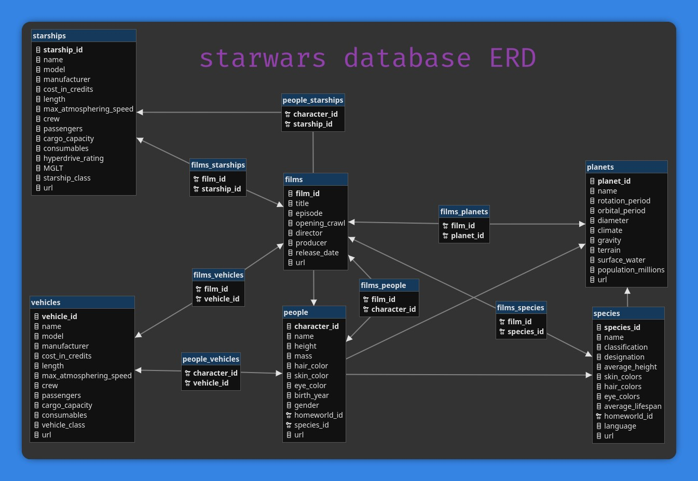

# Star Wars API to SQL Project

This project is an ETL (Extract, Transform, Load) pipeline that scrapes data from the [Star Wars API (SWAPI)](https://swapi.dev/), processes and cleans the data, and loads it into a relational MySQL database.

## Features

*   **Data Extraction**: Scrapes all data from the 6 main categories of the SWAPI: films, people, planets, species, starships, and vehicles.
*   **Data Caching**: Saves raw scraped data to a JSON file (`starwars_raw.json`) to prevent re-scraping on subsequent runs.
*   **Data Processing**: Processes the raw data by extracting entity IDs from URLs and structuring relationships. Caches the processed data as well (`starwars_processed_items.json`).
*   **Data Cleaning**: Cleans the data using `pandas`, converting data types, handling missing values (`unknown`, `n/a`), and standardizing formats.
*   **Database Normalization**: Structures the data into a normalized relational schema with main entity tables and junction tables to handle many-to-many relationships.
*   **Database Loading**: Populates a MySQL database with the cleaned and normalized data. The script is idempotent and will not re-insert data if the tables are already populated.

## Tech Stack

*   **Language**: Python 3.x
*   **Libraries**:
    *   `requests` for making HTTP requests to the SWAPI.
    *   `pandas` & `numpy` for data manipulation and cleaning.
    *   `SQLAlchemy` & `PyMySQL` for database interaction.
    *   `python-dotenv` for managing environment variables.
*   **Database**: MySQL

## Database Schema

The database is designed to be relational, with foreign keys linking entities. Many-to-many relationships (e.g., characters in a film) are handled via junction tables.

**Main Tables:**
*   `planets`
*   `species`
*   `vehicles`
*   `starships`
*   `films`
*   `people` (characters)

**Junction Tables:**
*   `films_people`
*   `films_planets`
*   `films_species`
*   `films_starships`
*   `films_vehicles`
*   `people_starships`
*   `people_vehicles`

For the detailed schema, please refer to the `database/create_sw_db.sql` file.

### ERD (Entity-Relationship Diagram)


## Setup and Installation

### 1. Prerequisites

*   Python 3.8+
*   A running MySQL server.

### 2. Clone the Repository

```bash
git clone <your-repository-url>
cd starwars-api-sql
```

### 3. Install Dependencies

It is recommended to use a virtual environment.

```bash
python -m venv venv
source venv/bin/activate  # On Windows, use `venv\Scripts\activate`
```

Install the required Python packages:

```bash
pip install -r requirements.txt
```
The main packages are:
- requests
- pandas
- numpy
- SQLAlchemy
- PyMySQL
- python-dotenv

The `requirements.txt` file is located under `scripts` folder.

### 4. Setup Database

Connect to your MySQL server and run the SQL script to create the database and tables.

```bash
mysql -u <your_user> -p < database/create_sw_db.sql
```

### 5. Configure Environment Variables

Create a `.env` file in the root directory of the project. This file will hold your database credentials. Add the following variables, replacing the placeholder values with your actual database connection details.

```env
DB_USER="your_db_user"
DB_PASSWORD="your_db_password"
DB_HOST="localhost"
DB_PORT="3306"
DB_NAME="starwars"
```

## Usage

To run the entire ETL pipeline, execute the main script from the project's root directory:

```bash
python scripts/swapi_scraping.py
```

The script will:
1.  Scrape data from SWAPI if `data/starwars_raw.json` is not found.
2.  Process the raw data if `data/starwars_processed_items.json` is not found.
3.  Create and clean pandas DataFrames.
4.  Create normalized CSV files in `data/csv_normalized/`.
5.  Connect to the database and insert data into the main and junction tables if they are empty.

You will see log messages in your console indicating the progress of each step.

## Project Structure

```
├── data/                 # Directory for cached JSON and exported CSV files
├── database/
│   └── create_sw_db.sql  # SQL script for DB schema creation
│   │── database_ERD.jpg  # ERD image
├── scripts/
│   └── swapi_scraping.py       # Main ETL script
│   │── swapi_scraping.ipynb    # Jupyter notebook version of the script
├── .env                  # Environment variables (needs to be created)
└── README.md             # This file
```